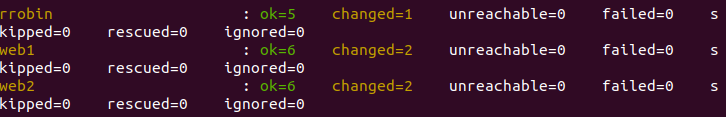

# ansible
Performing Labs
Задача:
1. На серверах rrobin, web1, web2 установить nginx.
2. На серверах web1, web2 Nginx должен работать по порту 8080 и отдавать кастомную страницу, зайдя на которую можно понять на каком сервере вы находитесь.
3. На сервере rrobin Nginx должен обеспечить балансировку нагрузки серверов web1 и web2 в режиме round-robin. Вес каждого сервера одинаковый.
4. Установка и настройка всего ПО должна быть обеспечена Ansible-сценарием.
5. Все файлы по этому заданию выложить в Github и написать ReadMe со скринами работоспособности и инструкцию по запуску вашего Ansible-сценария

 Выполнение:
 * 1.Реализовывем git clone в свою папку
 * 2.Меняем в файле VagrantFile 39-ю строку на собственный путь до ключа SSH
 * 3.Сохраняем 
 * 4.Запускаем папку через терминал
 * 5.Выполняем команду vagrant up
 * 6.Ждем выполнения команды
 * 7.Выполняем команду ansible-playbook nginx.yml
 * 8.Ждем появления окошка с результатом выполнения
 * 

 * 9.Для проверки переходим на 192.168.11.113
 * 10.В результате балансировки имя сервера должно меняться

